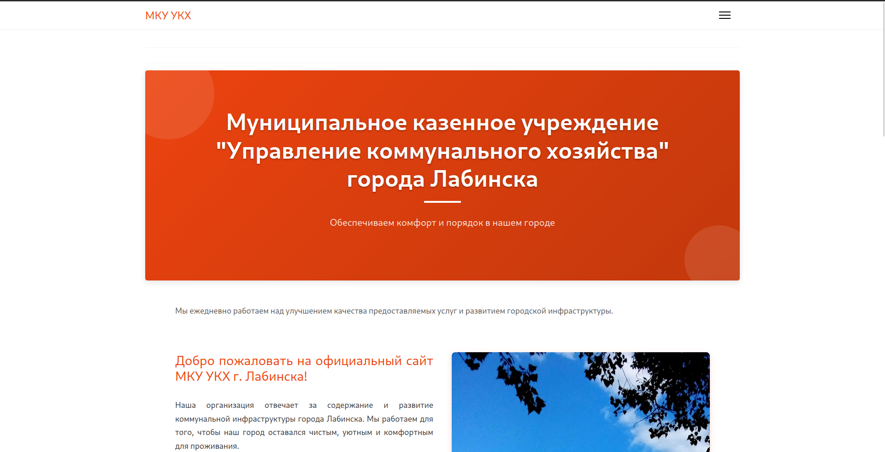
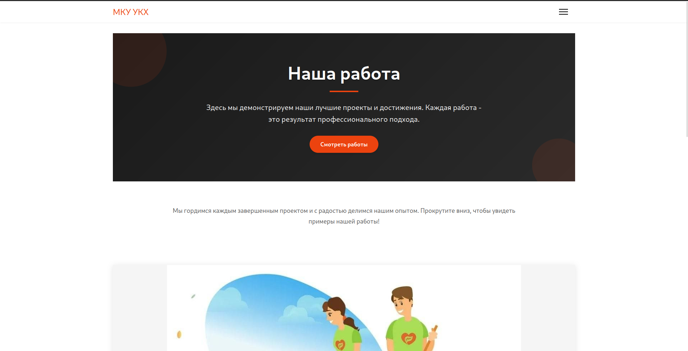

# Backup Joomla 5.3 Website – MCU UKH

Резервная копия сайта, созданного на **Joomla 5.3**. Этот репозиторий содержит полный бэкап для восстановления работы сайта в случае необходимости.

## 📂 Содержимое репозитория

- **/joomla** – Полная копия файлов Joomla (ядро, компоненты, модули, плагины)
- **/images** – Медиафайлы и загруженные изображения
- **/templates** – Установленные шаблоны
- **configuration.php** – Основной конфигурационный файл Joomla

## ⚙️ Требования для восстановления

- Веб-сервер (Apache) с PHP 8.1+
- MySQL 5.7+ или MariaDB 10.4+
- Joomla 5.3

## 🔄 Инструкция по восстановлению

1. Скопируйте все файлы из репозитория в корневую директорию вашего веб-сервера
2. Импортируйте SQL-дамп `backup.sql` в вашу СУБД
3. Настройте `configuration.php` под ваши параметры подключения к БД
4. Проверьте права доступа к файлам (рекомендуется 755 для директорий и 644 для файлов)

## 🛠 Техническая информация

- Версия Joomla: 5.3
- PHP версия при создании бэкапа: 8.2
- База данных: MySQL 8.0

## 🖼️ Картинки

